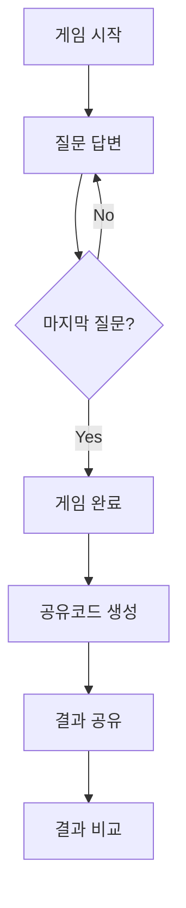

# 🎮 Balance Game

[](https://balance-game-ekedbfhkcxeyc8cb.koreacentral-01.azurewebsites.net)
[](https://spring.io/projects/spring-boot)
[](https://openjdk.java.net/projects/jdk/17/)
[](https://www.postgresql.org/)

## 🌐 실제 서비스 운영 중

**🔗 서비스 URL**: https://balance-game-ekedbfhkcxeyc8cb.koreacentral-01.azurewebsites.net  
**📊 상태**: 정상 운영 중 ✅  
**☁️ 배포 환경**: Microsoft Azure Cloud Platform

## 📋 프로젝트 개요

다양한 주제의 밸런스 게임 질문을 제공하고, 사용자가 원하는 질문을 조합하여 자신만의 **질문 묶음**을 만들고 **8자리 공유코드**로 공유할 수 있는 웹 서비스입니다.

### 🎯 핵심 특징
- **🎮 개인 중심 플레이**: 혼자서 게임하고 결과를 공유코드로 비교
- **🔒 품질 보장**: 관리자 승인제를 통한 고품질 콘텐츠
- **🌐 접근성**: 비회원도 즉시 게임 플레이 가능
- **📊 결과 분석**: 문항별 비교 및 일치율 계산

## 🏗️ 기술 스택

### 백엔드
```
├── Spring Boot 3.2.6
├── Java 17
├── Spring Security + JWT
├── Spring Data JPA + QueryDSL
├── PostgreSQL
└── Flyway Migration
```

### 클라우드 & 배포
```
├── Microsoft Azure
│   ├── App Service (Linux)
│   ├── PostgreSQL Flexible Server
│   └── Blob Storage
├── Docker Support
└── CI/CD Ready
```

### 모니터링 & 관리
```
├── Spring Boot Actuator
├── P6Spy (SQL 모니터링)
├── Custom Health Indicators
└── Metrics Collection
```

## 📁 프로젝트 구조

```
Balance_Game/
├── 📄 README.md                          # 프로젝트 개요
├── 📄 build.gradle                       # 빌드 설정
├── 📄 settings.gradle                    # 프로젝트 설정
├── 📄 Azure_배포_가이드.md                # Azure 배포 가이드
├── 📄 azure-deploy.ps1                   # Windows 배포 스크립트
├── 📄 azure-deploy.sh                    # Linux/Mac 배포 스크립트
├── 🗂️ src/
│   ├── main/
│   │   ├── java/Balance_Game/Balance_Game/
│   │   │   ├── 🏠 BalanceGameApplication.java
│   │   │   ├── 👤 admin/                 # 관리자 기능
│   │   │   ├── 🔐 auth/                  # 인증/인가
│   │   │   ├── 🎮 game/                  # 게임 플레이
│   │   │   ├── 📷 image/                 # 이미지 관리
│   │   │   ├── ❓ question/              # 질문 관리
│   │   │   ├── 👥 user/                  # 사용자 관리
│   │   │   └── 🛠️ common/               # 공통 기능
│   │   │       ├── config/              # 설정
│   │   │       ├── constants/           # 상수
│   │   │       ├── exception/           # 예외 처리
│   │   │       ├── health/              # 헬스 체크
│   │   │       ├── metrics/             # 메트릭 수집
│   │   │       └── util/                # 유틸리티
│   │   └── resources/
│   │       ├── 📄 application.yml
│   │       ├── 📄 application-azure.yml
│   │       └── db/migration/            # 데이터베이스 마이그레이션
│   │           ├── V1__init_database.sql
│   │           ├── V2__add_approval_and_share_system.sql
│   │           ├── V3__update_user_answer_add_session.sql
│   │           ├── V4__add_performance_indexes.sql
│   │           └── V5__add_performance_indexes_enhanced.sql
│   └── test/                             # 테스트 코드
├── 🗂️ build/                             # 빌드 출력
├── 🗂️ gradle/                            # Gradle 래퍼
├── 📄 gradlew                            # Unix 실행 스크립트
├── 📄 gradlew.bat                        # Windows 실행 스크립트
└── 🗂️ 보고서/                            # 프로젝트 문서
    ├── 📄 최종_프로젝트_보고서.md          # 메인 프로젝트 보고서
    ├── 📄 요구사항명세서.md               # 요구사항 정의
    ├── 📄 API_실제_엔드포인트_가이드.md    # API 사용법
    ├── 📄 Frontend_API_Guide.md          # 프론트엔드 연동 가이드
    ├── 📄 Frontend_Development_Guide.md  # 프론트엔드 개발 가이드
    ├── 📄 CORS_및_보안_설정_가이드.md      # 보안 설정 가이드
    ├── 📄 Code_Review_Report.md          # 코드 리뷰 보고서
    └── 📄 API_Documentation.md           # API 문서
```

## 🚀 빠른 시작

### 개발 환경 요구사항
- Java 17+
- PostgreSQL 14+
- Gradle 7+

### 로컬 개발 환경 설정

1. **저장소 클론**
   ```bash
   git clone https://github.com/your-username/Balance_Game.git
   cd Balance_Game
   ```

2. **데이터베이스 설정**
   ```sql
   CREATE DATABASE balance_game;
   CREATE USER balance_user WITH PASSWORD 'balance_password';
   GRANT ALL PRIVILEGES ON DATABASE balance_game TO balance_user;
   ```

3. **환경 설정 파일 생성**
   ```yaml
   # src/main/resources/application-secret.yml
   spring:
     datasource:
       url: jdbc:postgresql://localhost:5432/balance_game
       username: balance_user
       password: balance_password
   
   jwt:
     secret: your-jwt-secret-key
   
   spring:
     security:
       oauth2:
         client:
           registration:
             google:
               client-id: your-google-client-id
               client-secret: your-google-client-secret
   ```

4. **애플리케이션 실행**
   ```bash
   ./gradlew bootRun
   ```

5. **접속 확인**
   - 애플리케이션: http://localhost:8080
   - 헬스 체크: http://localhost:8080/actuator/health

## ☁️ Azure 배포

### 자동 배포 (권장)

**Windows (PowerShell)**
```powershell
.\azure-deploy.ps1
```

**Linux/Mac**
```bash
chmod +x azure-deploy.sh
./azure-deploy.sh
```

### 배포 환경
- **App Service**: Linux B1 (또는 F1 FREE)
- **PostgreSQL**: Flexible Server B1ms
- **Storage**: Blob Storage
- **SSL**: 강제 HTTPS 적용

자세한 배포 가이드는 [Azure_배포_가이드.md](./Azure_배포_가이드.md)를 참조하세요.

## 📚 API 문서

### 주요 엔드포인트

| 분류 | 엔드포인트 | 설명 |
|------|------------|------|
| 인증 | `POST /api/auth/login` | 로그인 |
| 인증 | `GET /api/oauth2/authorization/google` | Google 로그인 |
| 게임 | `POST /api/game/start` | 게임 시작 |
| 게임 | `POST /api/game/answer` | 답변 제출 |
| 게임 | `POST /api/game/compare` | 결과 비교 |
| 질문 | `GET /api/questions/popular` | 인기 질문 |
| 관리자 | `GET /api/admin/questions/pending` | 승인 대기 질문 |

### 상세 API 가이드
- [API 실제 엔드포인트 가이드](./보고서/API_실제_엔드포인트_가이드.md)
- [프론트엔드 API 가이드](./보고서/Frontend_API_Guide.md)

## 🔒 보안

### 인증 시스템
- **JWT 토큰**: HttpOnly 쿠키 방식
- **Refresh Token**: 7일 유효기간
- **OAuth2**: Google, Kakao 소셜 로그인

### 보안 설정
- **CORS**: 특정 헤더만 허용
- **HTTPS**: 강제 적용 (Azure)
- **SQL Injection**: JPA/QueryDSL로 방지
- **XSS**: 입력값 검증 및 이스케이프

## 🎯 핵심 기능

### 1. 게임 플레이 시스템


### 2. 승인 시스템
- 모든 질문은 관리자 승인 필요
- 승인/거절 사유 제공
- 일괄 처리 기능

### 3. 통계 시스템
- 실시간 플레이 통계
- 질문별 선택 비율
- 사용자 활동 분석

## 📊 성능 최적화

### 데이터베이스 최적화
- **N+1 쿼리 해결**: Fetch Join 적용
- **인덱스 최적화**: 15개 성능 인덱스
- **Connection Pool**: HikariCP 최적화

### 애플리케이션 최적화
- **공유코드 생성**: 충돌 방지 알고리즘
- **예외 처리**: 커스텀 예외 클래스
- **메트릭 수집**: 성능 모니터링

## 🧪 테스트

```bash
# 단위 테스트 실행
./gradlew test

# 통합 테스트 실행 (예정)
./gradlew integrationTest

# 전체 테스트 실행
./gradlew check
```

## 📈 모니터링

### 헬스 체크
```bash
curl https://balance-game-ekedbfhkcxeyc8cb.koreacentral-01.azurewebsites.net/actuator/health
```

### 메트릭
- 게임 플레이 횟수
- API 응답 시간
- 데이터베이스 연결 상태
- JVM 메모리 사용률

## 🤝 프론트엔드 개발자를 위한 가이드

### 연동 문서
- [프론트엔드 개발 가이드](./보고서/Frontend_Development_Guide.md)
- [CORS 및 보안 설정 가이드](./보고서/CORS_및_보안_설정_가이드.md)

### 환경 설정
```typescript
const API_BASE_URL = process.env.NODE_ENV === 'production' 
  ? 'https://balance-game-ekedbfhkcxeyc8cb.koreacentral-01.azurewebsites.net'
  : 'http://localhost:8080';
```

### CORS 도메인 추가 요청
프론트엔드 도메인을 CORS에 추가하려면 백엔드 팀에 요청하세요.

## 🔧 개발 도구

### 권장 IDE 설정
- **IntelliJ IDEA**: Ultimate 또는 Community
- **VS Code**: Java Extension Pack
- **Eclipse**: Spring Tools Suite

### 코드 품질
- **Lombok**: 보일러플레이트 감소
- **QueryDSL**: 타입 안전한 쿼리
- **P6Spy**: SQL 모니터링

## 📞 지원

### 기술 지원
- **이슈 리포트**: GitHub Issues
- **API 문의**: 백엔드 개발팀
- **배포 지원**: DevOps 팀

### 관련 문서
- [최종 프로젝트 보고서](./보고서/최종_프로젝트_보고서.md)
- [코드 리뷰 보고서](./보고서/Code_Review_Report.md)
- [요구사항 명세서](./보고서/요구사항명세서.md)

## 📄 라이선스

이 프로젝트는 MIT 라이선스 하에 있습니다. 자세한 내용은 [LICENSE](LICENSE) 파일을 참조하세요.

---

**🎮 Balance Game** - 2025년 운영 중인 실제 서비스  
*마지막 업데이트: 2025년 1월 14일*